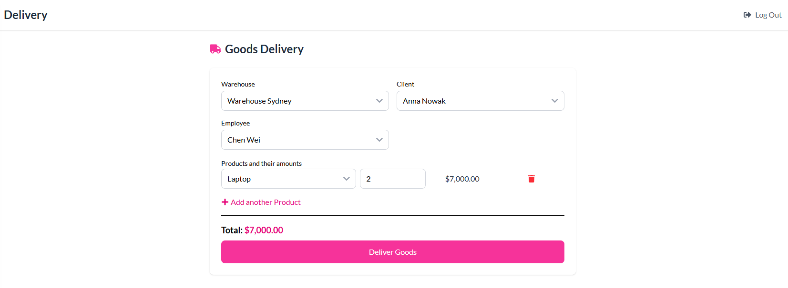

# Warehouse Management Application
A full-stack application for managing warehouses and monitoring the flow of goods between them. The system supports delivery registration, internal transfers, and outgoing shipments, along with real-time inventory tracking.

## Features
- Manage multiple warehouses
- Track current inventory levels
- Register incoming deliveries
- Handle transfers of goods between warehouses
- Register outgoing shipments
- View transaction history and warehouse activity logs
- View price history of products

## Technologies Used

### Backend
- **Spring Boot** (Java)
- **Spring Data JPA**
- **MySQL** – relational database
- **RESTful API** architecture

### Frontend
- **React.js**
- **Tailwind CSS**  – for UI styling

## My Role
This project was developed as part of a **5-person team**.
I was responsible for the **backend implementation** using **Spring Boot**. My key contributions included:
- Designing the domain model and database schema
- Implementing REST endpoints for all core operations (CRUD, transfer logic)
- Integrating the backend with the MySQL database using Spring Data JPA
- Ensuring proper data validation and error handling
- Supporting frontend integration by providing and documenting the API

## Documentation
There is also available detailed documentations:
- [API documentation](https://github.com/kpta119/WarehouseManagement/blob/main/API-Documentation.pdf): description of all endpoint (query parameters, path parameters, response and request bodies, status codes)
- [Database documentation](): precise desrciption of all tables in relational database

You can try the live version of the application here:  
👉 [https://bd2test-adrianeqqs-projects.vercel.app/](https://bd2test-adrianeqqs-projects.vercel.app/) (login: admin, password: admin)  

## 🖼️ Screenshots of applications

### 📍 Dashboard – Main panel

---

### 📦  List of products

---

### 🚚 Transfers – Moving Goods Between Warehouses

---

### 📬 Delivery Registration

---

### 🏢 Details of the warehouse
  

### 👨🏻‍💼 List of clients

